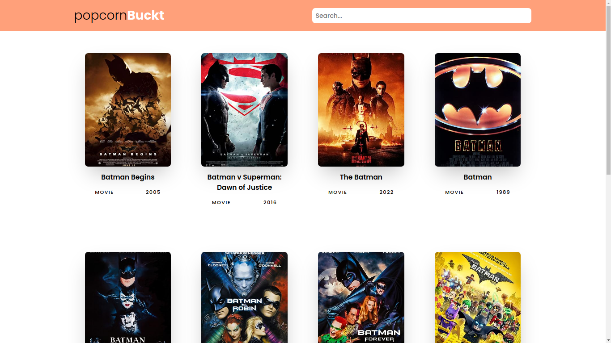

# popcornBuckt - Movie/TV Show Database App

popcornBuckt is a basic movie and TV show database application built using ReactJS. It fetches data from the OMDB API and displays the results on the page. It's a simple and straightforward app that allows users to search for movies and TV shows and view information about them.



## Features

- Search for movies and TV shows by title.
- View details such as title, year, plot, and poster image.
- Responsive design for a seamless experience on various devices.

## Installation

1. Clone the repository:

```sh
git clone https://github.com/bentekku/popcornBuckt-reactjs.git
```

2. Navigate to the project directory:

```sh
cd popcornBuckt-reactjs
```

3. Install dependencies:

```sh
npm install
```

4. Start the development server:

```sh
npm start
```

5. This automatically opens your default browser and navigates to `http://localhost:3000`.

## Usage

1. Enter the title of a movie or TV show in the search bar.
2. Click the "Search" button.
3. Results will be displayed below the search bar. Click on a result to view more details.

## Technologies Used

- ReactJS: A JavaScript library for building user interfaces.
- OMDB API: Open Movie Database API used for fetching movie and TV show data.

## Contributing

Contributions are welcome! If you find any bugs or have suggestions for improvements, please create an issue or submit a pull request.

## License

This project is licensed under the [MIT License](LICENSE).
